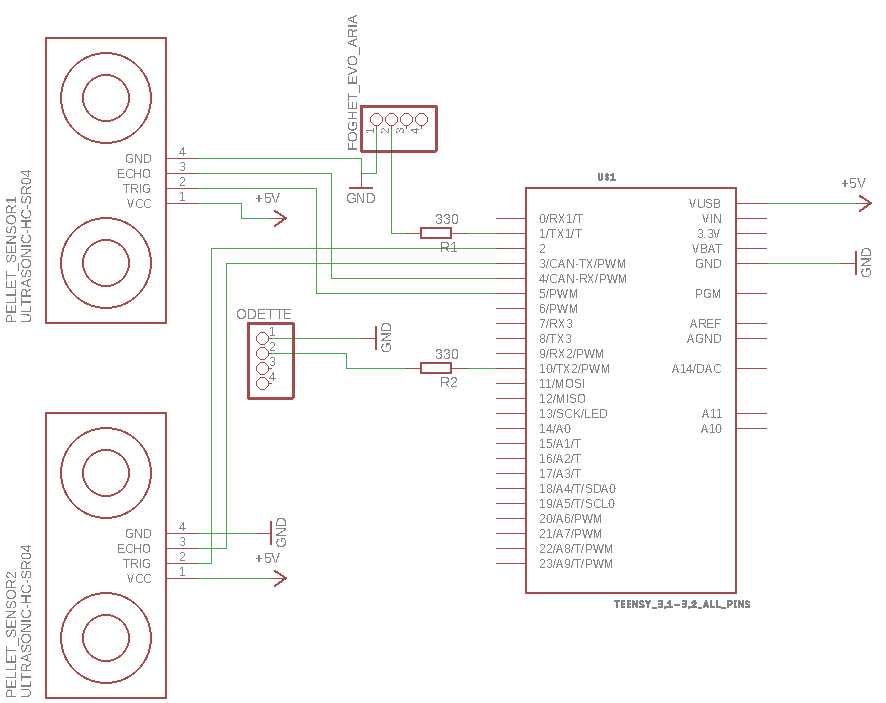
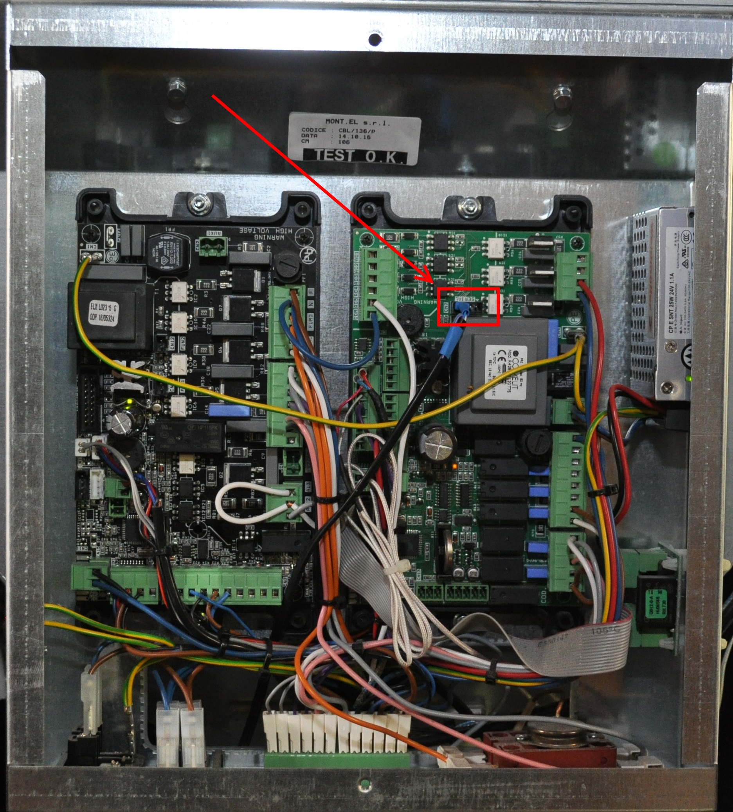
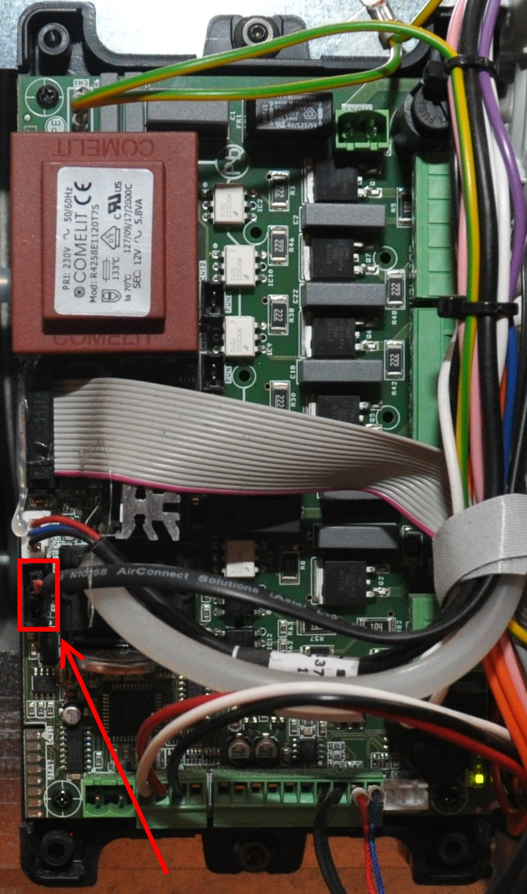

# Description
This project describes two methods to control JollyMec heaters using scripts and directly via the serial interface. Please be aware that by false wiring the serial interface you can damage the elecronics of your heater permanently. **I will not take any responsibility for damages to your heater.**

# Python script for webinterface
## Description
This method should be save, but only works for newer heaters. It will also require the official wifi module from JollyMec and an active internet connection.
## Installation
To use the script **python** must be installed including the following addons:
- **sys**
- **requests**
- **json**
- **os.path**
- **pickle**
- **time**
- **logging**
## Script variables
- **logging.basicConfig:** Enter a path to store the logfile and enter the log level.
- **cookieFile:** Enter a path where to store the file containing the http session id.
- **username:** JollyMec account username
- **password:** JollyMec account password
- **heaterId:** Id of your heater
- **retrycount:** Connection retries
## Script start arguments
- **set_power** [0 to 5] 
- **set_heater_on_off** [on/off]
- **get_state** (Returns the current state of the heater as json)

# Serial interface
## Description
This method requires wiring, soldering and a Teensy 3.2 and **can damage your heater** if you connect the wrong pins! There is some serious voltage on some of the pins that can damage the electronics. I myself damaged two electronic boards trying to reverse engineer this. I can also only provide wiring infos about the models **Foghet Evo ARIA** and **Odette**.
## Wiring
### Teensy 3.2
The [Teensy 3.2 Arduino](https://www.pjrc.com/store/teensy32.html "Teensy 3.2 Arduino") works as a bridge between the single wire serial port of the heaters and other devices that can only work with normal serial ports. Also some modifications are required to the kernel files of the Teensy 3.2 to enable support for the **Single Wire Serial** interface.

### Foghet Evo ARIA
**PIN1:** Ground (left pin)  
**PIN2:** RX/TX (second left pin)

### Odette
**PIN1:** Ground (top pin)  
**PIN2:** RX/TX (second pin from top)

## Modify Teensy 3.2 kernel files
To get the single wire serial interface to work some files must be replaced in the Teensy kernel. The files that must be replaced are:
- MySoftwareSerial.h
- serial1.c
- serial2.c
- serial3.c

You can find the modified files [here](https://github.com/TheNetStriker/cores/tree/SingleWireSerial/teensy3 "here") and [this](https://github.com/TheNetStriker/cores/commit/82d762ba9ccf741c450eff08eb6beaa19567e7b8 "this") ist the commit with the changes to the files. After the files have been modified the ino file should compile on the Teensy.
## Understanding the ino script
The ino script has some variables that have to be tweaked:  

**USE_HARDWARE_SERIAL**:  
I've included this variable to switch to a software emulated serial port. But I never got this working on non Teensy hardware. So best leave this variable set to **true**.  

**USE_SONAR_PELLET_SENSOR**:  
With this setting a sonar sensor can be enabled to determine how much pellets are left. I'am using a **HC-SR04** sensor for this.  

**device1Commands and device2Commands**:  
Here the command for the two heater models are stored. There are much more commands, but to find out what command does what is really time consuming.

**debugMode**
If enabled the serial port outputs text instead of the four byte messages.
## Commands
The commands to the Teensy serial port are based on four bytes:
1. Device id (1 or 2)
2. Command type
3. Value
4. Checksum (Modulo 256)
### Command types
- 0: Switch on/off (Value 0/1)
- 1: Power level (1 to 5)
### Special commands
- 0x00010102: Request status update on all values
## Events
The events sent by the Teensy are also based on the same four bytes as the commands, but they have more types.
### Event types
- 0: Switch off/on (Value 0/1)
- 1: Power level (1 to 5)
- 2: Smoke temperature in degrees
- 3: Ambient temperature in degrees
- 4: Ventilation level
- 5: Standby off/on (0/1)